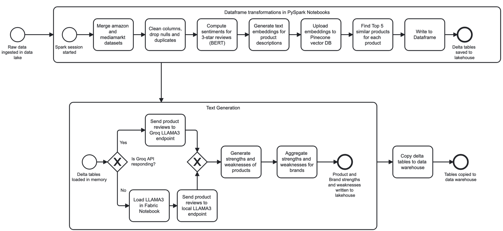

# DigiScan360

## Overview

DigiScan360 is a visual tool for competitive intelligence based on various data sources such as e-commerce, expert reviews and social media. It enables comprehensive analysis and insights through a combination of data collection, processing, and visualization.


## Directory Structure

### Property Graph

The `Property Graph` directory contains scripts to create a property graph for product feature analysis based on e-commerce data.

- **queries**: Cypher queries for graph algorithms and analytics.
- **scripts**: Python and Cypher scripts for loading and processing graph data.
### Knowledge Graph 

The `Knowledge Graph` directory contains scripts to create local schemas and global schema for Social Media and Ecommerce data.
- **LAV_mapping.py**: This script is designed to map and transfer RDF data from local repositories to a global repository using SPARQL CONSTRUCT queries and wrappers. It includes metadata tracking for source verification and audit trails. 
- **global_schema**: Contains a python to create the global schema tbox and its respective turtle file.
- **local_schema**: Contains python scripts to create seperate tbox and abox for each of the data sources and their respective tbox and abox turtle files.
- **queries**: SPARQL queries are presesented to perform graph analytics on global schema based on our KPIs.
### data-warehouse

The `data-warehouse` directory includes SQL scripts and other resources for setting up and managing a data warehouse in SQL Server. The data is formatted into a star schema with various views for easy access and analysis.

- **dbo**: Contains subdirectories for stored procedures, tables, and views.
  - **StoredProcedures**: SQL scripts for adding constraints and updating the warehouse schema.
  - **Tables**: SQL scripts for creating and managing database tables.
  - **Views**: SQL scripts for creating views for data aggregation and analysis.

### data_collection

The `data_collection` directory provides various data collection scripts and notebooks to gather data from Amazon, MediaMarkt, CNET, and generate synthetic data for Facebook and Twitter.

- **amazon_collector.ipynb**: Jupyter notebook for collecting data from Amazon.
- **azcs_uploader.py**: Python script for uploading data to Azure.
- **cnet_collector.py**: Python script for collecting data from CNET.
- **consumerTweets_collector.py**: Python script for collecting consumer tweets.
- **facebookData_collector.ipynb**: Jupyter notebook for collecting Facebook data.
- **mediamarkt_collector.py**: Python script for collecting data from MediaMarkt.
- **user_collector.py**: Python script for collecting user data.

### notebooks

The `notebooks` directory includes PySpark-based notebooks for various data processing and analysis tasks.

Additionally, we create Spark notebooks connected to the Lakehouse. These notebooks perform data preprocessing and merge predictive features, such as sentiment analysis and text generation, into the schema. The enriched data is saved to additional Delta tables.

- **Create ecommerce warehouse tables.ipynb**: Notebook for creating e-commerce warehouse tables.
- **Ecommerce Cleaning.ipynb**: Notebook for cleaning e-commerce data.
- **Ecommerce Data Merging.ipynb**: Notebook for merging e-commerce data.
- **social_media_and_expert_review_data_formatting.ipynb**: Notebook for cleaning Social Media and Expert Reveiws data.
- **Ecommerce Sentiment Analysis.ipynb**: Notebook for analyzing sentiment in e-commerce data.
- **Product_Similarity_Search.ipynb**: Notebook for performing product similarity searches using Pinecone.




**E-commerce Data Formatter**: In the first subprocess, a notable feature is the use of the cloud-hosted Pinecone vector database, as vector search is not currently available within Microsoft Fabric. Pinecone offers a generous amount of free credits per month. We utilize Pinecone specifically for product similarity searches within our existing data. After the initial historical load, we minimize write operations by only appending new products to Pinecone. This approach allows us to achieve extremely fast text similarity searches at no cost.

### text-generation

The `text-generation` directory contains scripts to use the LLAMA-3 model for text generation. These scripts primarily break product reviews into short summaries that cover the main points in each review, and generate strengths and weaknesses from the summaries on a product and brand hierarchy.

- **get_summaries.py**: Python script for generating summaries.
- **get_topics.py**: Python script for extracting topics.
- **get_topics_by_brand.py**: Python script for extracting topics by brand.
- **llama.py**: Python script related to the LLAMA model.
- **expert_review_strengths_and_weakness.py**: Python script to extract strengths and weaknesses of a product, its brand name, and product_type.

**E-commerce Data Formatter**: The second subprocess demonstrates the use of the Groq API for text generation with LLAMA-3. This free API leverages their GPU-equipped servers to run the LLM and provide output. To optimize latency, we use the Groq API whenever it is not rate-limiting our server. Otherwise, we deploy LLAMA-3 within a local PySpark notebook, which increases throughput at the cost of latency. Despite the model's 8 billion parameters, memory is not a concern, as PySpark notebooks offer 64 GB of RAM.

## Getting Started

To get started with this project, follow the instructions below.

### Prerequisites

- Python 3.x
- Required Python packages (listed in `requirements.txt`)

### Installation

1. Clone the repository:
   ```sh
   git clone https://github.com/yourusername/digiscan360.git
   cd digiscan360
   ```

2. Install the required packages:
   ```sh
   pip install -r requirements.txt
   ```

### Usage

Detailed instructions for using each component can be found in the respective directories. Here is a quick start guide for some of the main components:

#### Data Collection

Navigate to the `data_collection` directory and run the desired data collection script or notebook.

#### Data Warehouse

Navigate to the `data-warehouse` directory and run the SQL scripts.

#### Property Graph

Navigate to the `Property Graph` directory and use the provided scripts and queries to manage and analyze property graphs.

#### Knowledge Graph 
Navigate to the `Knowledge Graph` directory and use the provided scripts to create local and global schema, and use the SPARQL queries on global schema.

#### Text Generation

Navigate to the `text-generation` directory and run the desired script to generate summaries or extract topics.

## Architecture

Most of the architecture of this project is hosted on Microsoft Fabric. Specifically, the notebooks were all run there, and then data pipelines with copy activities were used to copy data from Azure Blob Storage to the Lakehouse and then to the Data Warehouse.

## Credits and Acknowledgements

We would like to thank the amazing faculty at Facultad de Informática de Barcelona (FIB) at Universitat Politècnica de Catalunya (UPC) for providing us the opportunity to work on such a grand project. Specifically, we thank Prof. Sergi Nadal for his mentorship and project follow-up sessions. A huge appreciation also goes to the DigiScan360 team ([Hareem Raza](https://github.com/hareemraza), [MD Kamrul Islam](https://github.com/kamrulkonok), [Muhammad Qasim Khan](https://github.com/QasimKhan5x), and [Narmina Mahmudova](https://github.com/nmahmudova)) for making this project a reality.
